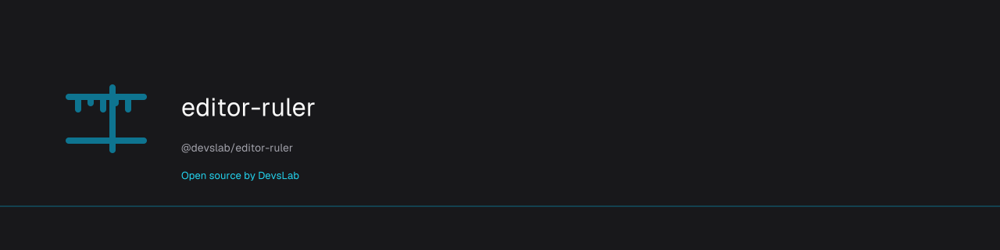

# @devslab/editor-ruler-tiptap

<p align="center">
  <a href="https://devslab.kr/brand/open-source/"></a>
</p>

**DevsLab 오픈소스** · [OSS 브랜드 가이드](https://devslab.kr/brand/open-source/) · Registry O01

[](https://www.npmjs.com/package/@devslab/editor-ruler-tiptap)

**[문서 & 라이브 데모](https://devslab-kr.github.io/editor-ruler/)** · [English](README.md)

**1.0.0부터 안정 버전** — export되는 API는 semver를 따릅니다. [안정성 범위](https://github.com/devslab-kr/editor-ruler#안정성) 참조.

[`@devslab/editor-ruler`](https://github.com/devslab-kr/editor-ruler)의 [Tiptap](https://tiptap.dev) 확장 — 에디터 위에 Word 스타일 가로 줄자(여백·첫 줄 들여쓰기 드래그 핸들 + 가이드선)를 추가합니다.

```bash
npm install @devslab/editor-ruler-tiptap @tiptap/core
```

```ts
import { Editor } from '@tiptap/core';
import StarterKit from '@tiptap/starter-kit';
import { EditorRuler } from '@devslab/editor-ruler-tiptap';

new Editor({
  element,
  extensions: [
    StarterKit,
    EditorRuler.configure({
      visible: true,     // false면 숨긴 채 시작 — 나중에
                         // editor.commands.showRuler()로 표시
      vertical: false,   // 생성 시 세로 줄자 표시
      verticalGutter: false, // 세로 줄자의 23px 자리를 처음부터 예약
                         // (scrollbar-gutter: stable 방식) — 토글해도
                         // 본문이 리플로우되지 않음
      unit: 'cm',        // 'cm' | 'in' | 'px'
      guides: true,      // 줄자에서 아래로 드래그 → 가이드선
      guideSnap: 5,      // 스냅 거리(px); 0이면 비활성
      types: ['paragraph', 'heading'],
      language: null,    // null = <html lang> → 브라우저 언어 → en
    }),
  ],
  content: '<p>안녕하세요</p>',
});
```

들여쓰기는 `rulerIndent` 노드 속성으로 저장되고 **순수 인라인 CSS**(`<p style="margin-left: 75px">`)로 렌더됩니다 — `editor.getHTML()` 출력이 그대로 이식 가능하고, 기존 인라인 들여쓰기도 파싱되어 들어옵니다. 드래그 제스처 전체가 정확히 **undo 1스텝**입니다 (드래그 중 트랜잭션은 히스토리 제외, 놓는 순간 baseline→final 기록).

표시/숨김은 **`showRuler` / `hideRuler` / `toggleRuler` 커맨드**(`editor.commands.toggleRuler()`)로 제어하고, 현재 상태는 `editor.storage.editorRuler.visible`에 있습니다. **세로 줄자**도 대응 커맨드가 있습니다 — `showVerticalRuler` / `hideVerticalRuler` / `toggleVerticalRuler`, 상태는 `editor.storage.editorRuler.verticalVisible`; 세로 줄자에서 오른쪽으로 드래그하면 세로 가이드가 생깁니다. 줄자 API는 `editor.storage.editorRuler.ruler`(`refresh`/`setUnit`/…), 세로 스트립은 `editor.storage.editorRuler.vruler`, 가이드는 `editor.storage.editorRuler.guides`로 접근합니다.

Tiptap v2·v3 모두 지원 (`@tiptap/core >= 2`).

라이선스: Apache-2.0 © devslab
